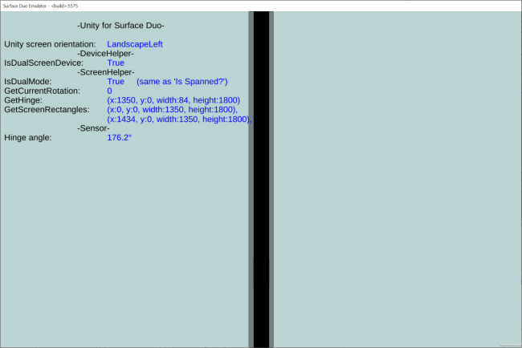

# Surface Duo ScreenHelper for Unity

Exposes dual-screen APIs for the Surface Duo to Unity game developers. YOu can access the screen size, the size of the mask where the device hinge is, and the hinge angle as the device is manipulated. This sample just displays these values on the screen, but they are ready for use in your Unity games.

## Prerequisites

- Unity 2018.4.18f1
- Project settings for Android include **x86**
- Surface Duo emulator

### Hinge angle sensor

Accessing the sensor requires an additional Android package. Build the [duo-android-plugin](/microsoft/surface-duo-sdk-unity-samples/tree/master/duo-android-plugin) library project in this repo, and copy the **SurfaceDuoHingeSensorPlugin.jar** file from **/library/release/** into the Unity folder **Assets/Android/plugin**.

## Result

## Next steps

Follow the steps from [this blog post](https://devblogs.microsoft.com/surface-duo/dual-screen-games-with-unity-for-android) to implement a custom gradle file in your Unity project and add the C# script that will let you access the device APIs in your game!