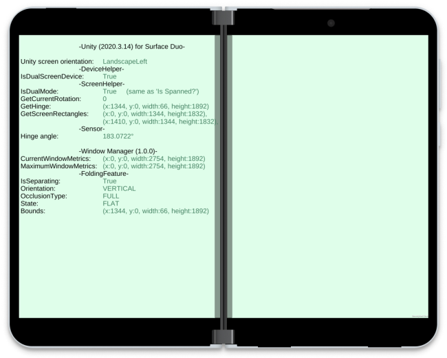

# Surface Duo ScreenHelper for Unity

Exposes dual-screen APIs for the Surface Duo to Unity game developers. You can access the screen size, the size of the mask where the device hinge is, and the hinge angle as the device is manipulated. This sample just displays these values on the screen, but they are ready for use in your Unity games.

## Prerequisites

- Unity 2020.3.14f1
- Project settings for Android
- Surface Duo or Surface Duo 2 device (or other foldable that supports Jetpack Window Manager)

_^ Unity 2019.3 and later will [not deploy to x86-based Android emulators](https://blogs.unity3d.com/2019/03/05/android-support-update-64-bit-and-app-bundles-backported-to-2017-4-lts/) so a Surface Duo device is required for testing. Use an older commit of this repo that targets Unity 2018 for Surface Duo emulator support._

### Dual-screen information

Uses [Jetpack Window Manager 1.0.0](https://developer.android.com/jetpack/androidx/releases/window#window-1.0.0) to access folding feature information.

### Hinge angle sensor

Accessing the sensor requires an additional Android package. Build the [duo-android-plugin](/microsoft/surface-duo-sdk-unity-samples/tree/master/duo-android-plugin) library project in this repo, and copy the **SurfaceDuoHingeSensorPlugin.jar** file from **/library/release/** into the Unity folder **/Assets/Plugins/Android/**.

## Result

**Surface Duo 2**

**Foldable device**

## Implementation details

- [Extending UnityPlayerActivity](https://docs.unity3d.com/Manual/AndroidUnityPlayerActivity.html)
- [Android Manifest](https://docs.unity3d.com/Manual/android-manifest.html)

## Next steps

Follow the steps from [this blog post](https://devblogs.microsoft.com/surface-duo/dual-screen-games-with-unity-for-android) to implement a custom gradle file in your Unity project and add the C# script that will let you access the device APIs in your game!
